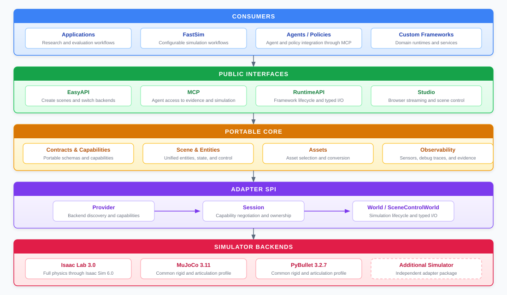

# UniRoboSim

[English](README.md) | [简体中文](README.zh-CN.md)

## 1. Overview and design philosophy

UniRoboSim is a backend-neutral interoperability layer for robotics simulation. It defines portable scene, lifecycle, command, state, sensor, asset, debug, and scene-control contracts while keeping native simulator SDKs in independently packaged adapters. Applications and upper-layer frameworks can select a backend without propagating simulator-specific types through their architecture.

Version `0.7.0` is the coordinated Beta feature release. Python packages use `0.7.x`; the serialized runtime/world contract is independently and explicitly versioned as `v0alpha4` / `unirobosim.world/v0alpha4`.



### Architecture principles

- EasyAPI and RuntimeAPI share one `WorldSpec` and one Provider → Session → World lifecycle. EasyAPI is only the shorter route into that runtime.
- Required capabilities are checked before a world is built. If a backend cannot provide something, the run stops with a useful error instead of quietly changing the experiment.
- The caller chooses `backend="isaaclab"`, `"mujoco"`, or `"pybullet"`. A framework may also select by capability, but UniRoboSim never hides which provider was chosen.
- Portable data follows explicit conventions: SI units, right-handed Z-up, XYZW quaternions, batch-first arrays, immutable specifications, and structured errors.
- Native SDKs remain behind adapters. In particular, Isaac Sim runs in a worker process because its lifecycle should not own the application.
- Backends and asset processors are ordinary Python plugins. A new adapter should not require a Core patch.

### What 0.7.0 provides

- rigid pose/twist, persistent wrench control, contact state, and scene pose writes;
- robot and non-robot articulation state plus position/velocity/effort commands;
- surface/volume deformable and fixed-count particle-fluid contracts;
- RGB/depth camera contracts;
- point, line, axes, text, bounding-box, and trajectory debug primitives;
- scene snapshots/deltas and idempotent drag transactions;
- backend-specific asset bundles, rigid USD conversion, and semantic normalization;
- deterministic Fake Reference Backend for SDK-free contract testing.

Capability availability remains backend-specific. Isaac Lab is the current full-physics backend for rigid bodies, articulations, surface/volume deformables, and particle fluids. MuJoCo and PyBullet support the common rigid/articulation/sensor/debug/scene profile and explicitly reject UniRoboSim soft-matter requests.

## 2. Installation

### Core

Python 3.12 is recommended for Core, Isaac Lab, MuJoCo, Studio, the USD converter, and MCP:

```bash
conda create -n unirobosim python=3.12 pip -y
conda activate unirobosim
git clone https://github.com/GitHofee/UniRoboSim.git
python -m pip install ./UniRoboSim
```

Core has no third-party runtime dependency and supports Python `>=3.11,<3.13`.

### Install a backend

Install Core and the selected adapter in the same environment after its native SDK is available:

```bash
# MuJoCo / Python 3.12
git clone https://github.com/GitHofee/UniRoboSim-mujuco.git
python -m pip install ./UniRoboSim-mujuco

# Isaac Lab / Python 3.12; install the verified NVIDIA SDK stack first
git clone https://github.com/GitHofee/UniRoboSim-isaaclab.git
python -m pip install ./UniRoboSim-isaaclab
```

PyBullet uses a separate Python 3.11 environment:

```bash
conda create -n unirobosim-pybullet python=3.11 pip -y
conda activate unirobosim-pybullet
git clone https://github.com/GitHofee/UniRoboSim.git
git clone https://github.com/GitHofee/UniRoboSim-pybullet.git
python -m pip install ./UniRoboSim ./UniRoboSim-pybullet
```

### Optional packages

| Package | Purpose | Python |
| --- | --- | --- |
| `unirobosim-usd-converter` | rigid USD conversion and Isaac physics normalization | `>=3.11,<3.13` |
| `unirobosim-studio` | browser Native Stream and Unified Scene control plane | `>=3.11,<3.13` |
| `unirobosim-mcp` | evidence queries, simulation reads, backend-camera images, and controlled agent actions | `>=3.11,<3.13` |

```bash
git clone https://github.com/GitHofee/UniRoboSim-usd-converter.git
git clone https://github.com/GitHofee/UniRoboSim-studio.git
git clone https://github.com/GitHofee/UniRoboSim-mcp.git
python -m pip install ./UniRoboSim-usd-converter ./UniRoboSim-studio ./UniRoboSim-mcp
```

For reproducible deployments, install the coordinated `0.7.0` wheel set and do not mix Core and adapter minor versions.

## 3. EasyAPI: quick start

### One application, explicit backend switch

Only the `backend` value changes between installed adapters:

```python
from unirobosim import Sim

with Sim(
    backend="mujoco",  # "isaaclab" or "pybullet"
    world_id="easy-demo",
    num_envs=1,
    time_step_seconds=0.002,
) as sim:
    box = sim.add_box(
        "red_box",
        size_m=(0.1, 0.1, 0.1),
        mass_kg=0.2,
        color_rgba=(1.0, 0.0, 0.0, 1.0),
        position_m=(0.0, 0.0, 0.5),
    )
    cabinet = sim.add_articulation(
        "cabinet",
        joint_names=("door_hinge",),
        initial_positions=(0.0,),
    )
    camera = sim.add_camera("camera", resolution=(640, 360), outputs=("rgb", "depth"))

    sim.require("control.articulation.position@1")
    sim.require("sensor.camera.rgb@1", reason="policy observation")
    sim.start()

    cabinet.command((0.5,), mode="position")
    box.apply_wrench((1.0, 0.0, 0.0))
    sim.step(30)

    print(box.state.positions_m.rows())
    print(cabinet.state.joint_positions.rows())
    print(camera.read("rgb").shape)
```

`require()` blocks unsupported runs; `optional()` records a preference without making it mandatory:

```python
sim.optional("state.fluid.particles@1", reason="use fluid only when native")
```

### SDK-free tests

```python
from unirobosim import Sim
from unirobosim.testing import FakeProvider

with Sim(provider=FakeProvider()) as sim:
    body = sim.add_box("box")
    sim.start()
    sim.step()
    print(body.state)
```

The Fake backend validates contracts and lifecycle. Its deterministic unit-mass point rules are not a physics-fidelity claim.

### Assets

Use one logical `AssetBundle` when simulators require different native formats:

```python
from unirobosim import AssetBundle, Sim

franka = AssetBundle(
    "franka",
    {
        "isaaclab": "assets/franka.usd",
        "mujoco": "assets/franka.xml",
        "pybullet": "assets/franka.urdf",
    },
)

with Sim(backend="isaaclab") as sim:
    robot = sim.add_articulation(
        "franka",
        joint_names=("panda_joint1",),
        asset=franka,
    )
    sim.start()
```

When `unirobosim-usd-converter` is installed, EasyAPI can compile rigid USD for MuJoCo/PyBullet or normalize visual-only rigid USD for Isaac Lab. Conversion is content-addressed and provenance-tracked. Articulated USD conversion is not claimed by the rigid-only converter; use verified native variants.

### Debug and scene control

`sim.debug` publishes portable debug primitives with stable IDs, layers, groups, budgets, and step lifetimes. `sim.scene_snapshot()`, scene deltas, and scene commands power Studio without exposing backend objects. Native Stream contains camera pixels from the simulator; Unified Scene is a backend-neutral 3D control surface whose drag commands update the real world.

## 4. MCP: working with agents

The optional MCP package provides an agent-facing interface in two deployment profiles:

- **Evidence profile (default):** bounded inspection of acceptance artifacts and debug traces.
- **Control profile (explicit):** backend discovery, server-owned simulation sessions, scene construction, commands, typed object reads, scene snapshots, and PNG images from backend RGB cameras.

Install and start the default Evidence profile:

```bash
git clone https://github.com/GitHofee/UniRoboSim-mcp.git
python -m pip install ./UniRoboSim-mcp
unirobosim-mcp --root /absolute/path/to/approved/evidence
```

Enable Control profile explicitly when the agent must operate a simulator:

```bash
unirobosim-mcp \
  --root /absolute/path/to/approved/evidence \
  --enable-control \
  --asset-root /absolute/path/to/approved/assets
```

Control mode owns only the sessions it creates. Mutations require a lease and idempotent `command_id`; reads do not require the write lease. Resource limits, asset allowlists, automatic lease expiry, and mutation audit records are applied by the server.

The complete tool catalog, request contracts, object-state fields, camera-image semantics, deployment options, security model, and Agent operating rules are maintained in the [UniRoboSim MCP README](https://github.com/GitHofee/UniRoboSim-mcp.git).

## 5. RuntimeAPI: building higher-level frameworks

RuntimeAPI is the framework-construction interface. It exposes immutable world compilation, capability negotiation, transactional lifecycle, typed commands and observations, deterministic resource ownership, and optional scene control without exposing a native simulator SDK.

Framework authors can use RuntimeAPI to implement domain-specific configuration, scheduling, controllers, policy serving, plugins, recording, replay, and distributed execution. For projects that require these facilities as an integrated product, **FastSim is the maintained upper-layer framework built on UniRoboSim**. UniRoboSim remains independently usable and does not require FastSim; FastSim uses RuntimeAPI so its upper layers remain independent of Isaac Lab, MuJoCo, and PyBullet.

```python
from unirobosim import (
    CapabilityId,
    CapabilityRequirement,
    EntityKind,
    EntityPath,
    EntitySpec,
    WorldSpec,
)
from unirobosim_mujoco import create_provider

provider = create_provider()
probe = provider.probe()
if not probe.available:
    raise RuntimeError(probe.reason)

session = provider.open()
try:
    requirements = (CapabilityRequirement(CapabilityId("state.articulation@1")),)
    negotiation = session.negotiate(requirements)
    if not negotiation.accepted:
        raise RuntimeError(negotiation.to_dict())

    spec = WorldSpec(
        "framework-world",
        (
            EntitySpec(
                EntityPath("/cabinet"),
                EntityKind.ARTICULATION,
                joint_names=("door_hinge",),
            ),
        ),
        requirements=requirements,
    )
    world = session.build(spec)
    try:
        handle = world.resolve(EntityPath("/cabinet"))
        world.reset()
        world.step()
        state = world.read_articulation(handle)
        print(world.build_report.fingerprint.to_dict(), state)
    finally:
        world.close()
finally:
    session.close()
```

### Recommended upper-layer boundaries

- Compile user-friendly configuration into immutable `WorldSpec`; keep raw dictionaries outside RuntimeAPI.
- Select a backend explicitly or by required capabilities, then persist the selected provider descriptor and build fingerprint.
- Let controllers, policies, rule-based systems, and agents submit commands asynchronously through your own scheduling layer; UniRoboSim does not decide where commands originate.
- Read observations through typed state/sensor APIs and isolate recording/replay as upper-layer extensions.
- Treat `World` as the lifecycle authority. Do not retain native handles or import adapter SDK modules in upper layers.
- Use `SceneControlWorld` only after capability negotiation; it is an optional extension, not a requirement for every backend.

This separation is what allows FastSim to add configuration, controllers, plugins, recording/replay, remote assets, and MCP without becoming tied to Isaac Lab, MuJoCo, or PyBullet.

## 6. Adapter SPI: integrating a new simulator

An adapter is a separate distribution that implements the structural `Provider`, `Session`, and `World` protocols and registers one factory entry point. Core never imports it directly.

### Integration steps

1. Choose a stable provider ID and declare only capabilities that are natively implemented and tested.
2. Keep package import and `probe()` lightweight; do not start the simulator during discovery.
3. Map portable `WorldSpec` entities into native entities transactionally. A failed build must leave the session reusable.
4. Maintain a stable `EntityPath` → native handle table and reject stale handles after reset/rebuild.
5. Translate units, frames, quaternion order, batching, command persistence, and state shapes exactly.
6. Implement deterministic reset/step/close and clean every process/resource owned by the adapter.
7. Implement `SceneControlWorld` only if snapshot/delta/pose/drag semantics are real.
8. Register the backend entry point and run Core conformance plus native acceptance tests.

### Minimal SPI shape

```python
from unirobosim import (
    CapabilityDeclaration,
    CapabilityId,
    CapabilitySet,
    FrozenMap,
    ProbeReport,
    ProviderDescriptor,
)

DESCRIPTOR = ProviderDescriptor(
    provider_id="vendor.simulator",
    display_name="Vendor Simulator",
    version="0.1.0",
    contract_version="v0alpha4",
    capabilities=CapabilitySet(
        (
            CapabilityDeclaration(CapabilityId("state.rigid_body@1")),
            CapabilityDeclaration(CapabilityId("control.rigid_body.wrench@1")),
        )
    ),
    metadata=FrozenMap({"native_sdk": "1.2.3"}),
)


class VendorProvider:
    @property
    def descriptor(self):
        return DESCRIPTOR

    def probe(self):
        # Inspect availability only; do not launch the simulator here.
        return ProbeReport(DESCRIPTOR, available=True)

    def open(self):
        return VendorSession(DESCRIPTOR)


def create_provider():
    return VendorProvider()
```

The distribution registers the factory in `pyproject.toml`:

```toml
[project]
dependencies = ["unirobosim>=0.7.0,<0.8"]

[project.entry-points."unirobosim.backends"]
vendor = "unirobosim_vendor:create_provider"
```

`VendorSession` must implement `descriptor`, `negotiate()`, `build()`, and `close()`. Its built `VendorWorld` must implement the complete base `World` protocol. Methods for capabilities the adapter does not advertise must still fail with a structured `UnsupportedCapabilityError`; they must not return fabricated values.

### Adapter release gate

- import boundary test proves no native SDK is imported by package discovery;
- descriptor/package/entry-point versions match;
- capability declarations match observable behavior;
- lifecycle tests cover build failure, close idempotency, reset, stale handles, and reopen;
- command/state tests cover every declared mode, batch, environment selection, and unit convention;
- native tests run against pinned SDK/GPU inputs where applicable;
- wheel is installed and exercised in a clean supported Python environment.

Core development uses:

```bash
python -m pip install -e '.[dev]'
ruff format --check src tests
ruff check src tests
mypy src
coverage run -m pytest
coverage report
```

The 0.7.0 coordinated release passed 212 Core tests, adapter suites, clean-wheel smoke tests, and native MuJoCo/PyBullet/Isaac Lab acceptance.
