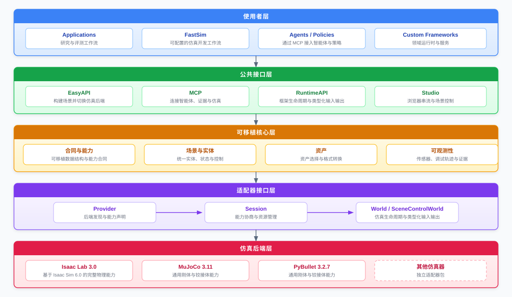

# UniRoboSim

[English](README.md) | [简体中文](README.zh-CN.md)

## 1. 概览与设计思想

UniRoboSim 是面向机器人仿真的后端中立互操作层。它定义可移植的场景、生命周期、命令、状态、传感器、资产、调试与场景控制合同，并将原生仿真器 SDK 隔离在独立发布的 Adapter 中。应用和上层框架可以选择仿真后端，而不必让仿真器专用类型扩散到整体架构。

`0.10.4` 将所有实体位姿明确定义为导入资产或模型的根参考系。在 USD 后端中，
它就是生成的实体 Prim，绝不从 articulation root link 推断；物理 link 位姿仍由
显式 link-state API 提供。



### 架构原则

- EasyAPI 和 RuntimeAPI 共用同一个 `WorldSpec` 以及 Provider → Session → World 生命周期。EasyAPI 只是更短的入口，不是第二套 Runtime。
- 构建世界前先检查必需能力。后端做不到就给出明确错误，不偷偷改变实验含义。
- `backend="isaaclab"`、`"mujoco"`、`"pybullet"` 由调用方决定。框架也可以按能力选择，但最终用了哪个 Provider 必须可见。
- 可移植数据采用明确约定：SI 单位、右手 Z-up、XYZW 四元数、batch-first 数组、不可变 Spec 和结构化错误。
- 原生 SDK 留在 Adapter 后面。尤其是 Isaac Sim，它运行在 worker 进程中，不应该接管应用生命周期。
- Backend 和资产处理器就是普通 Python 插件。新增 Adapter 不应要求修改 Core。

### 0.10 提供的能力

- 刚体位姿/速度、持续 wrench、接触状态和场景位姿写入；
- 机器人及非机器人铰接体状态与位置/速度/力矩控制；
- 表面/体积柔性体与固定粒子数流体合同；
- physical-v0alpha5 静态场景资产与类型化 parent-local 相机挂载；
- v0alpha6 混合物理复合场景与构建期嵌入刚体/铰接体绑定；
- RGB/深度/法线相机合同；
- 通过 `ArrayValue.to_bytes()` 读取紧凑 RGB 字节，且不改变传感器 shape 与 dtype；
- 点、线、坐标轴、文本、包围盒和轨迹调试图元；
- 场景快照/增量与幂等拖拽事务；
- 通过后端中立 Protocol 提供 planning-scene 目录、状态/增量、Frame 与关节拓扑、附着关系和哈希固定的几何资源；
- 经能力声明控制、由 Provider 自身维护且不暴露原生句柄的运行时资源诊断；
- 后端资产 Bundle、刚体 USD 转换和物理语义规范化；
- 用于无 SDK 合同测试的确定性 Fake Reference Backend。

能力仍由后端决定。当前覆盖刚体、铰接体、表面/体积柔性体和粒子流体的完整物理后端是 Isaac Lab；MuJoCo 和 PyBullet 支持通用刚体/铰接体/传感器/调试/场景 profile，并明确拒绝 UniRoboSim 柔性物质请求。

## 2. 如何安装

### Core

Core、Isaac Lab、MuJoCo、USD Converter 和 MCP 推荐 Python 3.12：

```bash
conda create -n unirobosim python=3.12 pip -y
conda activate unirobosim
git clone --branch v0.10.4 --depth 1 https://github.com/GitHofee/UniRoboSim.git
python -m pip install ./UniRoboSim
```

Core 无第三方运行时依赖，支持 Python `>=3.11,<3.13`。

### 安装 Backend

先准备对应原生 SDK，再把 Core 与 Adapter 安装到同一环境：

```bash
# MuJoCo / Python 3.12
git clone --branch v0.9.3 --depth 1 https://github.com/GitHofee/UniRoboSim-mujoco.git
python -m pip install ./UniRoboSim-mujoco

# Isaac Lab / Python 3.12；先安装已验证的 NVIDIA SDK 运行栈
git clone --branch v0.10.12 --depth 1 https://github.com/GitHofee/UniRoboSim-isaaclab.git
python -m pip install ./UniRoboSim-isaaclab
```

PyBullet 使用单独的 Python 3.11 环境：

```bash
conda create -n unirobosim-pybullet python=3.11 pip -y
conda activate unirobosim-pybullet
git clone --branch v0.10.4 --depth 1 https://github.com/GitHofee/UniRoboSim.git
git clone --branch v0.9.3 --depth 1 https://github.com/GitHofee/UniRoboSim-pybullet.git
python -m pip install ./UniRoboSim ./UniRoboSim-pybullet
```

### 已验证发布矩阵

| Distribution | 发布标签 | Python | Core 兼容范围 |
| --- | --- | --- | --- |
| `unirobosim` | `v0.10.0` | `>=3.11,<3.13` | Core |
| `unirobosim-isaaclab` | `v0.10.12` | `>=3.12,<3.13` | `unirobosim>=0.10.4,<0.11` |
| `unirobosim-mujoco` | `v0.9.3` | `>=3.12,<3.13` | `unirobosim>=0.9,<0.11` |
| `unirobosim-pybullet` | `v0.9.3` | `>=3.11,<3.12` | `unirobosim>=0.9,<0.11` |
| `unirobosim-usd-converter` | `v0.10.0` | `>=3.11,<3.13` | `unirobosim>=0.10,<0.11` |
| `unirobosim-mcp` | `v0.10.0` | `>=3.11,<3.13` | `unirobosim>=0.10,<0.11` |

该表是已经发布且相互兼容的源码版本线。可复现安装应固定这些标签；`main` 是持续演进的开发分支，可能独立更新。

### 可选包

```bash
git clone --branch v0.10.0 --depth 1 https://github.com/GitHofee/UniRoboSim-usd-converter.git
git clone --branch v0.10.0 --depth 1 https://github.com/GitHofee/UniRoboSim-mcp.git
python -m pip install ./UniRoboSim-usd-converter ./UniRoboSim-mcp
```

`unirobosim-studio` 不属于当前已发布版本集，因此有意不写入安装命令。

Core 0.10 Adapter 必须声明实际支持的 World schema。Provider 在通过复合场景原生闸门前不得声明支持 v0alpha6。

## 3. EasyAPI：快速使用

如需按顺序学习并直接执行，请从 [EasyAPI 示例路径](demo/easyapi/README.zh-CN.md)开始。

### 一套代码，显式切换后端

安装不同 Adapter 后只修改 `backend`：

```python
from unirobosim import Sim

with Sim(
    backend="mujoco",  # 也可为 "isaaclab" 或 "pybullet"
    world_id="easy-demo",
    num_envs=1,
    time_step_seconds=0.002,
) as sim:
    box = sim.add_box(
        "red_box",
        size_m=(0.1, 0.1, 0.1),
        mass_kg=0.2,
        color_rgba=(1.0, 0.0, 0.0, 1.0),
        position_m=(0.0, 0.0, 0.5),
    )
    cabinet = sim.add_articulation(
        "cabinet",
        joint_names=("door_hinge",),
        initial_positions=(0.0,),
    )
    camera = sim.add_camera("camera", resolution=(640, 360), outputs=("rgb", "depth"))

    sim.require("control.articulation.position@1")
    sim.require("sensor.camera.rgb@1", reason="policy observation")
    sim.start()

    cabinet.command((0.5,), mode="position")
    box.apply_wrench((1.0, 0.0, 0.0))
    sim.step(30)

    print(box.state.positions_m.rows())
    print(cabinet.state.joint_positions.rows())
    print(camera.read("rgb").shape)
```

`require()` 阻止不支持的运行；`optional()` 只记录偏好：

```python
sim.optional("state.fluid.particles@1", reason="use fluid only when native")
```

### 无 SDK 测试

```python
from unirobosim import Sim
from unirobosim.testing import FakeProvider

with Sim(provider=FakeProvider()) as sim:
    body = sim.add_box("box")
    sim.start()
    sim.step()
    print(body.state)
```

Fake Backend 用于验证合同和生命周期，其确定性单位质量点规则不代表真实物理精度。

### 复合 USD 场景

`COMPOSITE_SCENE` 与不可变的 `STATIC_SCENE` 是两种不同合同。v0alpha6 World
只组合一次混合物理 USD，然后把声明过的逻辑实体绑定到既有的容器相对
Prim。`Sim.start(build_input=...)` 必须接收完整且摘要固定的 `BuildInput`；
每一个会被读取的本地 layer、mesh 和 texture 都应进入既有
`BuildResourceManifest` 依赖图。

```python
scene = sim.add_composite_scene(
    "room",
    asset_uri="assets/room.usd",
    scale_xyz=(0.1, 0.1, 0.1),           # 下方绑定了铰接门，因此使用等比缩放
)
door = sim.add_embedded_articulation(
    "cabinet_door",                       # 逻辑路径为 /room/cabinet_door
    container=scene,
    root_body_prim_path="root/cabinet/base",
    link_prims={
        "base": "root/cabinet/base",
        "door": "root/cabinet/door",
    },
    joint_prims={"hinge": "root/cabinet/hinge"},
)
sim.start(build_input=locked_build_input)  # 由资产/编译层提供
door.command((0.7,))
```

绑定中的 Prim path 均相对于组合容器，不能使用绝对路径或路径穿越片段。
MuJoCo 与 PyBullet 在各自 Provider 明确实现 `scene.composite@1` 和
`entity.embedded-binding@1` 前会拒绝该 profile。

Core 会保留每一个正数 XYZ 值，并自动要求 `entity.scale.composite_scene@1`；具体物理
有效性由所选 Provider 负责。因此 Provider 可以支持静态场景非等比缩放，同时明确拒绝
同样的变换包裹铰接机构，而不会静默改变物理含义。

### 资产

仿真器原生格式不同时，用一个逻辑 `AssetBundle`：

```python
from unirobosim import AssetBundle, Sim

franka = AssetBundle(
    "franka",
    {
        "isaaclab": "assets/franka.usd",
        "mujoco": "assets/franka.xml",
        "pybullet": "assets/franka.urdf",
    },
)

with Sim(backend="isaaclab") as sim:
    robot = sim.add_articulation(
        "franka",
        joint_names=("panda_joint1",),
        asset=franka,
    )
    sim.start()
```

安装 `unirobosim-usd-converter` 后，EasyAPI 可为 MuJoCo/PyBullet 编译刚体 USD，或为 Isaac Lab 规范化纯视觉刚体 USD。转换采用内容寻址并记录来源。刚体转换器不承诺铰接 USD 转换，铰接资产应使用验证过的原生变体。

### Debug 与场景控制

`sim.debug` 发布带稳定 ID、layer、group、预算和 step 生命周期的可移植图元。`sim.scene_snapshot()`、场景增量和命令为 Studio 提供能力，而不暴露后端对象。Native Stream 是仿真器相机像素；Unified Scene 是后端中立 3D 控制面，其拖拽命令会修改真实仿真世界。

## 4. MCP：配合 Agent 使用

可选 MCP 包提供面向 Agent 的接口，分为两种部署 Profile：

- **Evidence Profile（默认）：** 有边界地检查验收产物和 Debug Trace。
- **Control Profile（显式启用）：** 发现后端、创建 Server 自有仿真会话、构建场景、提交命令、读取类型化对象状态、获取场景快照，以及取得后端 RGB 相机 PNG 图像。

安装并启动默认 Evidence Profile：

```bash
git clone https://github.com/GitHofee/UniRoboSim-mcp.git
python -m pip install ./UniRoboSim-mcp
unirobosim-mcp --root /absolute/path/to/approved/evidence
```

Agent 需要操作仿真器时，显式启用 Control Profile：

```bash
unirobosim-mcp \
  --root /absolute/path/to/approved/evidence \
  --enable-control \
  --asset-root /absolute/path/to/approved/assets
```

Control Profile 只管理自身创建的会话。写操作需要租约和具备幂等语义的 `command_id`，读操作不需要写租约；Server 同时实施资源上限、资产目录白名单、租约自动过期和写操作审计。

完整 Tool 清单、请求合同、对象状态字段、相机图像语义、部署选项、安全模型和 Agent 操作规则见 [UniRoboSim MCP README](https://github.com/GitHofee/UniRoboSim-mcp.git)。

## 5. RuntimeAPI：构建上层框架

框架开发者可以先完成 [Runtime API 示例路径](demo/runtime_api/README.zh-CN.md)，再接入原生后端。

RuntimeAPI 是构建上层框架的接口。它提供不可变世界编译、能力协商、事务化生命周期、类型化命令与观测、确定的资源所有权和可选场景控制，同时不向上暴露原生仿真器 SDK。

框架开发者可以基于 RuntimeAPI 实现面向领域的配置、调度、Controller、策略服务、插件、录制回放和分布式执行。对于需要这些能力以完整产品形态交付的项目，**FastSim 是基于 UniRoboSim 构建并持续维护的上层框架**。UniRoboSim 可以独立使用且不依赖 FastSim；FastSim 通过 RuntimeAPI 保持其上层逻辑与 Isaac Lab、MuJoCo 和 PyBullet 解耦。

```python
from unirobosim import (
    CapabilityId,
    CapabilityRequirement,
    EntityKind,
    EntityPath,
    EntitySpec,
    WorldSpec,
)
from unirobosim_mujoco import create_provider

provider = create_provider()
probe = provider.probe()
if not probe.available:
    raise RuntimeError(probe.reason)

session = provider.open()
try:
    requirements = (CapabilityRequirement(CapabilityId("state.articulation@1")),)
    negotiation = session.negotiate(requirements)
    if not negotiation.accepted:
        raise RuntimeError(negotiation.to_dict())

    spec = WorldSpec(
        "framework-world",
        (
            EntitySpec(
                EntityPath("/cabinet"),
                EntityKind.ARTICULATION,
                joint_names=("door_hinge",),
            ),
        ),
        requirements=requirements,
    )
    world = session.build(spec)
    try:
        handle = world.resolve(EntityPath("/cabinet"))
        world.reset()
        world.step()
        state = world.read_articulation(handle)
        print(world.build_report.fingerprint.to_dict(), state)
    finally:
        world.close()
finally:
    session.close()
```

### 上层框架边界建议

- 将用户友好配置编译为不可变 `WorldSpec`，不要让 RuntimeAPI 接收原始字典。
- 显式选择后端或按能力选择，并保存 Provider Descriptor 与 Build Fingerprint。
- Controller、Policy、rule-based 系统和 Agent 通过上层异步调度提交命令；UniRoboSim 不判断命令来源。
- 通过类型化状态/传感器 API 读取观测，把录制/回放留在上层扩展。
- 以 `World` 为生命周期权威，不在上层保留 native handle 或导入 Adapter SDK 模块。
- 只有协商通过后才使用 `SceneControlWorld`；它是可选扩展，不是所有后端的强制要求。

因此 FastSim 可以增加配置、Controller、插件、录制/回放、远程资产和 MCP，同时不绑定 Isaac Lab、MuJoCo 或 PyBullet。

## 6. Adapter SPI：接入新仿真器

[Adapter SPI 示例路径](demo/adapter_spi/README.zh-CN.md)提供可安装的教学 Adapter、公共合同测试、
entry point 发现和干净 wheel 闸门。

Adapter 是独立 distribution，实现结构化 `Provider`、`Session`、`World` Protocol，并注册一个工厂 entry point；Core 不直接导入它。

### 接入步骤

1. 选择稳定 Provider ID，只声明已原生实现并完成测试的能力。
2. 保持包导入与 `probe()` 轻量，发现阶段不能启动仿真器。
3. 将可移植 `WorldSpec` 事务化转换为原生实体；构建失败后 Session 仍须可用。
4. 维护稳定的 `EntityPath` → native handle 表，reset/rebuild 后拒绝 stale handle。
5. 精确转换单位、坐标、四元数顺序、batch、命令持续性和状态 shape。
6. 实现确定性的 reset/step/close，并清理 Adapter 拥有的全部进程与资源。
7. 只有真实实现快照/增量/位姿/拖拽语义时才实现 `SceneControlWorld`。
8. 注册 backend entry point，运行 Core conformance 与原生验收。

### 最小 SPI 结构

```python
from unirobosim import (
    CapabilityDeclaration,
    CapabilityId,
    CapabilitySet,
    FrozenMap,
    ProbeReport,
    ProviderDescriptor,
)

DESCRIPTOR = ProviderDescriptor(
    provider_id="vendor.simulator",
    display_name="Vendor Simulator",
    version="0.1.0",
    contract_version="v0alpha4",
    capabilities=CapabilitySet(
        (
            CapabilityDeclaration(CapabilityId("state.rigid_body@1")),
            CapabilityDeclaration(CapabilityId("control.rigid_body.wrench@1")),
        )
    ),
    supported_world_schema_versions=("unirobosim.world/v0alpha4",),
    metadata=FrozenMap({"native_sdk": "1.2.3"}),
)


class VendorProvider:
    @property
    def descriptor(self):
        return DESCRIPTOR

    def probe(self):
        # 这里只检查可用性，不能启动仿真器。
        return ProbeReport(DESCRIPTOR, available=True)

    def open(self):
        return VendorSession(DESCRIPTOR)


def create_provider():
    return VendorProvider()
```

在 `pyproject.toml` 注册工厂：

```toml
[project]
dependencies = ["unirobosim>=0.10,<0.11"]

[project.entry-points."unirobosim.backends"]
vendor = "unirobosim_vendor:create_provider"
```

该依赖边界描述 Core 0.10 Adapter 版本线。Adapter 必须明确声明实际实现的 World schema，并在发布兼容性声明前通过独立原生闸门。

`VendorSession` 必须实现 `descriptor`、`negotiate()`、`build()`、`close()`；构建出的 `VendorWorld` 必须实现完整基础 `World` Protocol。未声明能力的方法仍须以结构化 `UnsupportedCapabilityError` 失败，不能返回伪造值。

运行时资源诊断是可选的 Provider 扩展。实现该扩展的 Adapter 声明 `runtime.diagnostics@1`，并提供 `runtime_diagnostics() -> RuntimeDiagnostics`。可选能力属性 `connection_modes` 必须是非空、元素唯一的规范模式名 JSON 数组，例如 `["direct", "gui"]`；返回的 `connection_mode` 必须属于该数组。为兼容早期诊断 Provider，省略此属性时不限制模式。计数范围仅限该 Provider 实例拥有的资源，且绝不暴露原生 ID 或句柄。

### Adapter 发布闸门

- Import boundary 测试证明插件发现不会导入原生 SDK；
- descriptor/package/entry-point 版本一致；
- 能力声明与可观测行为一致；
- 生命周期覆盖构建失败、幂等 close、reset、stale handle 和 reopen；
- 每种已声明控制模式、batch、环境选择和单位约定都有命令/状态测试；
- 需要时在固定 SDK/GPU 输入上执行原生测试；
- wheel 在全新受支持 Python 环境中安装并实际运行。

Core 开发验证命令：

```bash
python -m pip install -e '.[dev]'
ruff format --check src tests
ruff check src tests
mypy src
coverage run -m pytest
coverage report
```

0.10.0 Core 发布闸门覆盖完整 Core 测试，以及 Python 3.11 与 3.12 上全新的 source、wheel、sdist 安装。原生 GPU、GUI 与后端 Adapter 验收仍须通过独立 Adapter 闸门。
